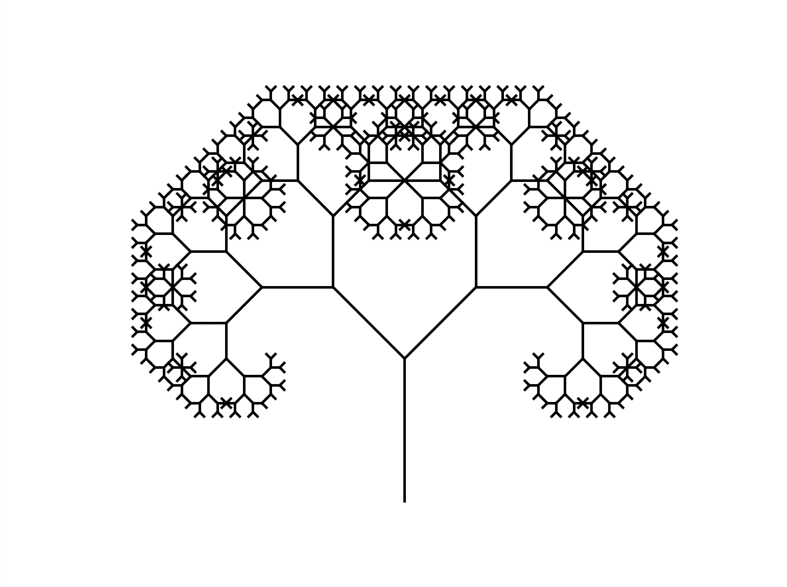
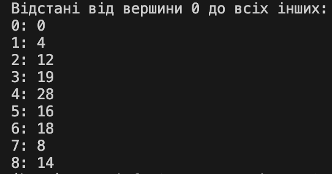
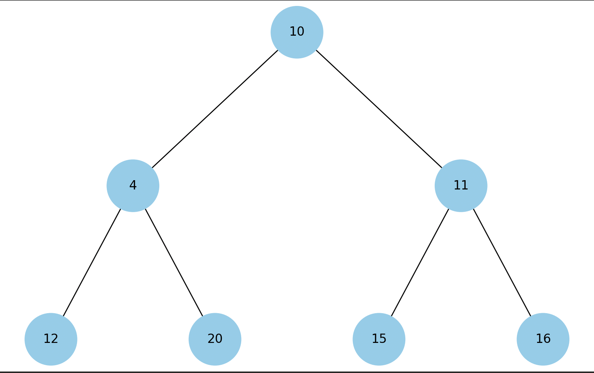
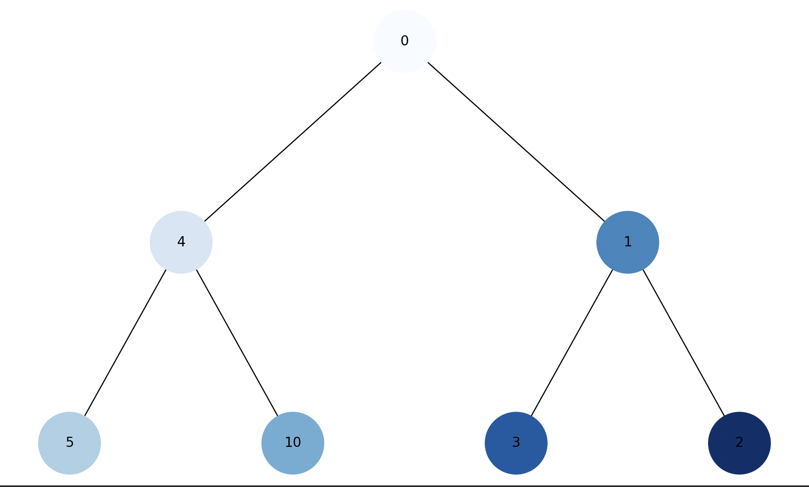
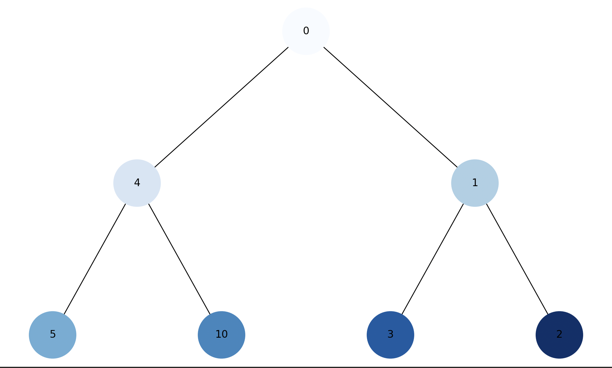
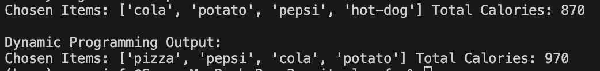
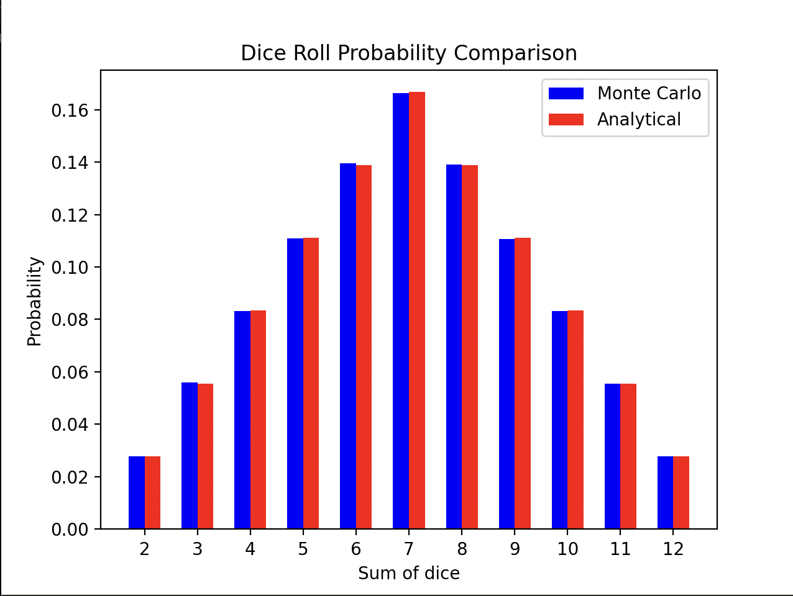

# Завдання та їх виконання

Цей документ містить описи та висновки по семи завданням, які були виконані.

## Завдання 1: Робота з однозв'язним списком

### Опис
Реалізація функцій для роботи з однозв'язним списком, включаючи вставку, видалення та оборот елементів списку.

### Методи
- Робота зі структурами даних.
- Алгоритми сортування.

### Висновки
Створені функції ефективно виконують необхідні операції над списком.

## Завдання 2: Створення фрактала “дерево Піфагора”

### Опис
Розробка програми для візуалізації фрактала "дерево Піфагора" за допомогою рекурсії.

### Методи
- Рекурсивні алгоритми.

### Висновки
Фрактал був успішно створений і візуалізований, демонструючи красу математичних структур.

## Завдання 3: Реалізація алгоритму Дейкстри

### Опис
Розробка алгоритму Дейкстри для знаходження найкоротших шляхів у зваженому графі.

### Методи
- Графові алгоритми.

### Висновки
Алгоритм успішно вирішує задачу пошуку найкоротших шляхів.

## Завдання 4: Візуалізація піраміди

### Опис
Візуалізація структури бінарної купи у вигляді піраміди.

### Методи
- Візуалізація даних.

### Висновки
Структура бінарної купи була наочно представлена, що дозволяє краще зрозуміти її властивості.

## Завдання 5: Візуалізація обходу бінарного дерева

### Опис
Створення програми для візуалізації обходу бінарного дерева у глибину та в ширину.

### Методи
- Алгоритми обходу дерев.

### Висновки
Візуалізація надала чітке уявлення про процеси обходу, підтверджуючи їх коректність.

## Завдання 6: Жадібні алгоритми та динамічне програмування

### Опис
Реалізація жадібного алгоритму та алгоритму динамічного програмування для розв'язання задачі оптимізації.

### Методи
- Жадібні алгоритми.
- Динамічне програмування.

### Висновки
Методи показали різницю в ефективності та точності рішень, зокрема в комплексних задачах оптимізації.

## Завдання 7: Метод Монте-Карло

### Опис
Використання методу Монте-Карло для моделювання випадкових процесів та оцінки ймовірностей.

### Методи
- Статистичне моделювання.

### Висновки
Метод Монте-Карло демонструє свою універсальність та точність при розрахунку ймовірностей у складних задачах.

Цей метод виявився особливо корисним для моделювання випадкових процесів та оцінки ймовірностей, що дозволило детально аналізувати та порівнювати симуляційні дані з теоретичними розрахунками ймовірностей.

**Основні моменти виконання задачі:**

- **Велика кількість симуляцій**: Завдяки проведенню симуляції мільйону кидків кубиків, можна було забезпечити статистичну значимість отриманих результатів, що є ключовим аспектом методу Монте-Карло.
- **Точність ймовірностей**: Симуляційні результати були дуже близькими до аналітичних розрахунків, що демонструє точність методу Монте-Карло в умовах правильної реалізації і достатнього обсягу даних.
- **Візуалізація даних**: Використання графічного представлення результатів дозволило наочно порівняти симуляційні дані з теоретичними значеннями, що забезпечило краще розуміння відмінностей та точності моделювання.
- **Важливість і застосування**:
Метод Монте-Карло, який був використаний у цьому завданні, є важливим інструментом у різних галузях, включаючи фінанси, інженерію, дослідження операцій та науки про навколишнє середовище. Його універсальність та здатність моделювати складні системи з різноманітними випадковими процесами робить цей метод цінним інструментом для аналізу та прийняття рішень на основі імовірностей та ризиків.

